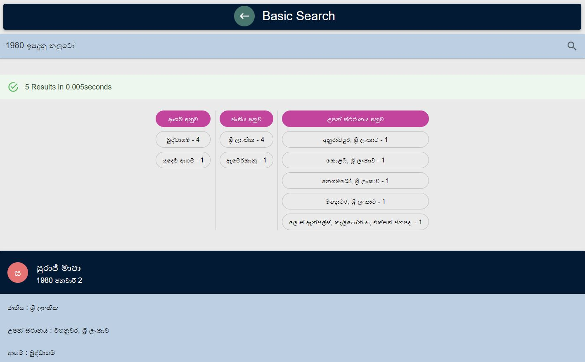
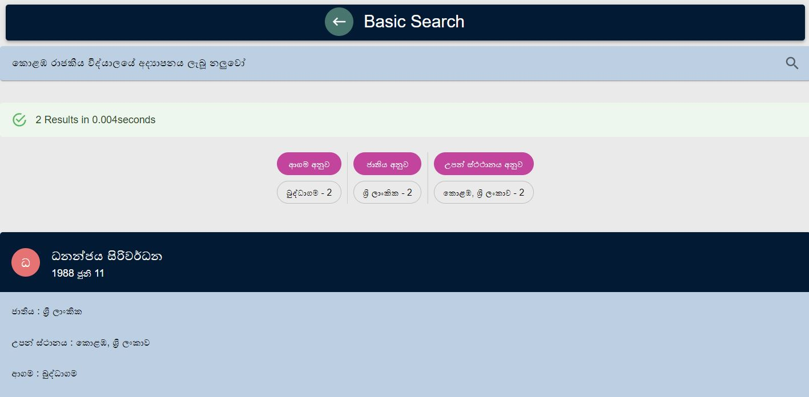

# Search Engine for actors
This project contains React frontend and a Python Flask backend server which design for search actors using Elastic search.


## Getting Started
### Setting Up Elasticsearch
Download and run [Elasticsearch](https://www.elastic.co/downloads/elasticsearch).
  > This project was made using Elasticsearch version 7.15.0


### Setting Up the Index
> Alternatively, you can restore the index from the provided elasticsearch snapshot in the `es_snapshots/` folder [See more on snapshot and restore](https://www.elastic.co/guide/en/elasticsearch/reference/current/snapshot-restore.html)

1. Create an index named `actors` in the Elasticsearch and execute below queries.
```

PUT /actors
{
  "settings": {
    "index": {
      "analysis": {
        "analyzer": {
          "sinhalaAnalyzer": {
            "type": "custom",
            "tokenizer": "icu_tokenizer",
            "filter": ["edgeNgram"],
            "char_filter": ["dotFilter"]
          }
        },
        "filter": {
          "edgeNgram": {
            "type": "edge_ngram",
            "min_gram": 2,
            "max_gram": 50,
            "side": "front"
          }
        },
        "char_filter": {
          "dotFilter": {
            "type": "mapping",
            "mappings": ". => \\u0020"
          }
        }
      }
    }
  }
}
```
```

PUT actors/_mappings/
{
  "properties": {
    "නම": {
      "type": "text",
      "fields": {
        "keyword": {
          "type": "keyword",
          "ignore_above": 256
        }
      },
      "analyzer": "sinhalaAnalyzer",
      "search_analyzer": "standard"
    },
    "පෞද්ගලික ජීවිතය": {
      "type": "text",
      "fields": {
        "keyword": {
          "type": "keyword",
          "ignore_above": 256
        }
      },
      "analyzer": "sinhalaAnalyzer",
      "search_analyzer": "standard"
    },
    "වෘත්තිය ජීවිතය": {
      "type": "text",
      "fields": {
        "keyword": {
          "type": "keyword",
          "ignore_above": 256
        }
      },
      "analyzer": "sinhalaAnalyzer",
      "search_analyzer": "standard"
    },
    "උපන් දිනය": {
      "type": "text",
      "fields": {
        "keyword": {
          "type": "keyword",
          "ignore_above": 256
        }
      },
      "analyzer": "sinhalaAnalyzer",
      "search_analyzer": "standard"
    },
    "උපන් ස්ථානය": {
      "type": "text",
      "fields": {
        "keyword": {
          "type": "keyword",
          "ignore_above": 256
        }
      },
      "analyzer": "sinhalaAnalyzer",
      "search_analyzer": "standard"
    },
        "අධ්‍යාපනය": {
      "type": "text",
      "fields": {
        "keyword": {
          "type": "keyword",
          "ignore_above": 256
        }
      },
      "analyzer": "sinhalaAnalyzer",
      "search_analyzer": "standard"
    },
    "ජාතිය": {
      "type": "text",
      "fields": {
        "keyword": {
          "type": "keyword",
          "ignore_above": 256
        }
      },
      "analyzer": "sinhalaAnalyzer",
      "search_analyzer": "standard"
    },
    "ආගම": {
      "type": "text",
      "fields": {
        "keyword": {
          "type": "keyword",
          "ignore_above": 256
        }
      },
      "analyzer": "sinhalaAnalyzer",
      "search_analyzer": "standard"
    }
  }
}

```
2. To add documents to the created index using the [Bulk API](https://www.elastic.co/guide/en/elasticsearch/reference/current/docs-bulk.html) run bulk.py along with actors.json file

> You may use Kibana/POSTMAN  or any other option for query operations.

### Setting Up the Python Server
1. Install python and pip version 3
2. Install required python packages by running the following command in the project home directory. `$ pip install -r requirements.txt`
3. Download and setup [SinLing](https://github.com/nlpc-uom/Sinling). You may have to append project path to your path environment variable.
4. Configure the index name and Elasticsearch host:port details in `/server/app.py` file.
```
index_name = 'actors'
es = Elasticsearch('localhost', port=9200)
```

### Setting Up React Front-end
1. Download and install required node packages by running `npm install` in the `/frontend` directory.

## Running the Project
1. Run the Elasticsearch instance.
2. To Run python backend server by executing `python main.py` in the `/server` directory.
3. Run the React web app by executing `npm start` command in the `/frontend/` directory.

## Basic Usage Examples
* Search by a actor name.


* Search by an birth year/month.


* Search by the education.


* Search by the birth location.


* Search for the exact phrases.


* Search for perticular attribute of given actor.


* Advance search with more filters.


## Additional Details
The project utilizes the below query types in Elasticsearch.
* [Multi-match query](https://www.elastic.co/guide/en/elasticsearch/reference/current/query-dsl-multi-match-query.html) with certain fields boosted
* [Boolean query](https://www.elastic.co/guide/en/elasticsearch/reference/current/query-dsl-bool-query.html)

Aditionally, below query options were also used.
* [Terms Aggregation](https://www.elastic.co/guide/en/elasticsearch/reference/current/search-aggregations-bucket-terms-aggregation.html)
* [Sort](https://www.elastic.co/guide/en/elasticsearch/reference/6.8/search-request-sort.html)

This project uses the `Sinhala Tokenizer` from [SinLing](https://github.com/nlpc-uom/Sinling), a language processing tool for Sinhala language.

Also, the project uses a `Sinhala Stemmer` from 'https://github.com/e11379dana/SinhalaStemming'.

English to Sinhala translations are done using the [translate](https://pypi.org/project/translate/) python package.
